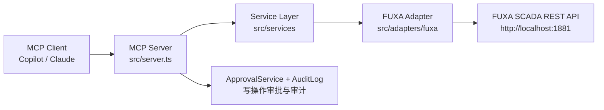

# FUXA-MCP AI Gateway 使用教学文档

> 本文档面向需要在**真实 FUXA SCADA 项目**上通过 **MCP（Model Context Protocol）** 调用并编辑项目的使用者。
> 覆盖：环境准备、启动 FUXA、启动网关、配置 MCP 客户端、调用读工具、调用写工具、验证与截图。

---

## 1. 项目概览

本仓库 `fuxa-ai-gateway` 实现了一个基于 MCP 的 AI 网关，让 AI 助手（如 GitHub Copilot、Claude 等支持 MCP 的客户端）能够：

- **读取** FUXA 项目（健康检查、项目结构、标签搜索、历史数据分析、告警分析、设备诊断）
- **写入** FUXA 项目（添加设备，需显式开启写入并指定审批人，所有写操作进入审计日志）

架构分层（严格单向依赖）：



技术栈：TypeScript（strict）、Node.js ≥ 22、`@modelcontextprotocol/sdk`、Zod、Vitest。

---

## 2. 环境准备

### 2.1 前置条件

| 组件 | 版本要求 | 说明 |
|------|----------|------|
| Node.js | ≥ 22 | 网关与 FUXA 均依赖 |
| FUXA SCADA | v1.3.4 | 安装在 `C:\Users\27796\FUXA` |
| npm | 随 Node 安装 | 管理依赖 |

### 2.2 安装网关依赖

```bash
cd "C:\Users\27796\Desktop\RA-Intern\FUXA-MCP\fuxa-ai-gateway"
npm install
```

### 2.3 配置文件 `.env`

复制 `.env.example` 为 `.env` 并填写：

```bash
# FUXA 连接
FUXA_BASE_URL=http://localhost:1881
FUXA_API_KEY=
FUXA_USERNAME=
FUXA_PASSWORD=

# 服务器
HOST=0.0.0.0
PORT=3000
LOG_LEVEL=info

# 写操作开关（关键！默认关闭）
# 设为 true 才会允许通过 MCP 写 FUXA（如添加设备）
FUXA_WRITE_ENABLED=false
```

> **安全提示**：`FUXA_WRITE_ENABLED` 默认关闭。只有当你确定要允许 AI 修改 FUXA 项目时才设为 `true`。
> 本机 FUXA 已关闭 `secureEnabled`（未启用登录鉴权），直接用 HTTP 访问即可。

---

## 3. 启动 FUXA SCADA

FUXA 以 Node 进程运行，监听 **1881** 端口。

```bash
node "C:\Users\27796\FUXA\server\main.js"
```

启动成功后，浏览器访问 <http://localhost:1881> 可以看到 FUXA 界面（Alarms 首页、Editor 编辑器、Lab 等菜单）。


> 如果本机 FUXA 开启了安全登录，需先在浏览器登录，或在网关 `.env` 中配置 `FUXA_USERNAME` / `FUXA_PASSWORD`。

---

## 4. 构建并启动网关

### 4.1 构建

```bash
npm run build
```

产物输出到 `dist/`。

### 4.2 以标准输入输出（stdio）模式启动

MCP 服务器默认通过 **stdio** 与客户端通信，客户端会以子进程方式拉起它：

```bash
node dist/index.js
```

**重要**：不要直接在普通终端里这样跑，它等待的是 MCP 协议消息。应由 MCP 客户端配置来启动（见第 5 节）。

### 4.3 常用 npm 脚本

| 脚本 | 作用 |
|------|------|
| `npm run dev` | 用 `tsx` 直接运行 TS 源码 |
| `npm run build` | TypeScript 编译 |
| `npm run test` | 运行 Vitest 单元测试 |
| `npm run test:coverage` | 测试 + 覆盖率 |
| `npm run lint` | ESLint 检查 |
| `npm run format` | Prettier 格式化 |

---

## 5. 配置 MCP 客户端

任何支持 MCP 的客户端（VS Code / Copilot、Claude Desktop、Cline 等）都可以通过 **stdio** 启动本网关。示例配置：

```jsonc
{
  "mcpServers": {
    "fuxa-ai-gateway": {
      "command": "node",
      "args": [
        "C:\\Users\\27796\\Desktop\\RA-Intern\\FUXA-MCP\\fuxa-ai-gateway\\dist\\index.js"
      ],
      "env": {
        "FUXA_BASE_URL": "http://localhost:1881",
        "FUXA_WRITE_ENABLED": "true"
      }
    }
  }
}
```

> 若未写 `FUXA_WRITE_ENABLED`，则默认 `false`，写工具会被拒绝。

---

## 6. 可用 MCP 工具一览

| 工具名 | 读写 | 参数 | 作用 |
|--------|------|------|------|
| `fuxa_health_check` | 读 | 无 | 检查 FUXA 连接与网关健康状态 |
| `fuxa_project_overview` | 读 | 无 | 返回 FUXA 项目总览（设备数、标签数、设备列表摘要） |
| `fuxa_list_devices` | 读 | 无 | 返回完整设备树（设备 id/名称/类型/使能 + 每个设备绑定的标签 id/名称/类型/地址/单位） |
| `fuxa_search_tags` | 读 | `query` | 自然语言搜索标签 |
| `fuxa_analyze_history` | 读 | `tagId`,`from`,`to` | 分析标签历史数据（均值/最值/趋势/异常） |
| `fuxa_compare_periods` | 读 | `tagId`,`from1`,`to1`,`from2`,`to2` | 对比两个时间段 |
| `fuxa_alarm_analysis` | 读 | `alarmId` | 告警链路分析（告警→设备→标签→历史→诊断） |
| `fuxa_diagnose_equipment` | 读 | `deviceId` | 设备健康诊断（当前状态+历史+告警） |
| `fuxa_metrics` | 读 | 无 | 网关 Prometheus 监控指标 |
| `fuxa_add_device` | **写** | `device`,`approver` | 向 FUXA 项目添加设备（结构写入，需审批人） |
| `fuxa_write_tag_value` | **写** | `deviceId`,`tagId`,`value`,`approver` | 向设备的某个标签写入运行时值（如开关泵/设设定值，需审批人） |

---

## 7. 调用读工具（示例）

以 `fuxa_search_tags` 为例，MCP 客户端发出调用后，网关会代理到 FUXA 并返回结果：

```json
{
  "query": "冷却泵温度"
}
```

返回示例：

```json
{
  "query": "冷却泵温度",
  "results": [
    {
      "device": "dev-cooling-pump",
      "variable": "temperature",
      "unit": "°C",
      "description": "冷却泵温度"
    }
  ]
}
```

其他读工具同理：`fuxa_health_check` 无参数，`fuxa_analyze_history` 传 `tagId` + ISO 时间区间。

---

## 8. 调用写工具（fuxa_add_device）

写操作受 **ApprovalService** 与 **AuditLog** 双重保护。

### 8.1 前提

1. 网关以 `FUXA_WRITE_ENABLED=true` 启动；
2. 调用时提供 `approver`（审批人身份）。

### 8.2 示例调用

```json
{
  "device": {
    "id": "dev-cooling-pump",
    "name": "冷却水泵",
    "type": "Simulation",
    "enabled": true,
    "property": {},
    "tags": {
      "temperature": {
        "name": "temperature",
        "type": "number",
        "unit": "°C"
      }
    }
  },
  "approver": "engineering-lead"
}
```

### 8.3 返回结果

写操作被允许时返回：

```json
{
  "allowed": true,
  "approvalId": "appr-1"
}
```

当 `FUXA_WRITE_ENABLED=false`（默认）时返回：

```json
{
  "allowed": false,
  "reason": "write operations are disabled"
}
```

### 8.4 注意事项（FUXA 行为）

- FUXA 在收到 `projectData` 写入后 **会重启服务**，导致本次响应连接被断开。网关的 `DeviceWriteService` 已做容错：若写入后出现连接错误，会主动**再次查询确认设备是否真的添加成功**。
- 因此即使返回报"连接失败"，设备**通常已成功写入**，请在 FUXA Editor 中确认。

---

## 9. 调用写工具（fuxa_write_tag_value — 向设备写入数据）

`fuxa_add_device` 只做**项目结构**写入（新增设备）。若要**向某个设备写入运行时数据**（例如开/关一台泵、设定一个设定值），使用 `fuxa_write_tag_value`。

FUXA 的实时标签值不是通过 HTTP `projectData` 写入的，而是通过 **socket.io** 连接写入：网关的 `SocketIoValueWriter` 会连接 FUXA 并发送与前端完全一致的 `device-values` 消息：
`{ cmd: 'set', var: { source: <deviceId>, id: <tagId>, value } }`。

### 9.1 示例调用

```json
{
  "deviceId": "dev-hex-1",
  "tagId": "supplyT",
  "value": 88.5,
  "approver": "engineering-lead"
}
```

### 9.2 返回结果

```json
{
  "allowed": true,
  "reason": "write approved for fuxa_write_tag_value",
  "approvalId": "appr-1"
}
```

### 9.3 注意事项

- 与添加设备不同，**值写入不会触发 FUXA 重启**。
- 值是否最终生效取决于目标设备的通信插件（PLC/Modbus/MQTT 等底层连接）；对未真正运行通信插件的设备，写消息仍会被 FUXA 接收，但不一定有可回读的生效值。
- 该工具同样受 `FUXA_WRITE_ENABLED` 与 `approver` 双重门控，并写入审计日志。

---

## 10. 验证写入是否成功

### 9.1 通过 MCP 读工具验证

写入后用 `fuxa_project_overview` 或 `fuxa_search_tags` 查询新设备/标签是否出现。

### 9.2 通过 FUXA 界面验证

打开 <http://localhost:1881/#/editor>，在设备列表中应能看到新添加的设备（如 `dev-cooling-pump`）。

### 9.3 通过 FUXA REST API 直接验证（可选）

```bash
# 读取项目（含 devices）
curl -X GET "http://localhost:1881/api/project"
```

在返回 JSON 的 `devices` 数组中查找目标设备即可。

---

## 11. 测试与质量

```bash
npm run test          # 单元测试（当前 99 个全部通过）
npm run test:coverage # 覆盖率
```
npm run build         # 编译
npm run lint          # 静态检查
```

仓库内置端到端脚本（`scripts/`）：
- `e2e-read.mjs`：读取链路验证（健康/项目/标签搜索）
- `e2e-write.mjs`：写入链路验证（受 `WRITE_ENABLED` 环境变量控制）
- `screenshot.mjs`：用 Playwright 对 FUXA 界面截图
- `fuxa-write-direct.mjs`：直接 `fetch` 添加设备的对照脚本

---

## 12. 常见问题（FAQ）

| 现象 | 原因 | 解决 |
|------|------|------|
| 写操作返回 `allowed:false` | `FUXA_WRITE_ENABLED` 未设为 `true` | 设置环境变量后重启网关 |
| 写入后报"无法连接 FUXA" | FUXA 写入后重启、连接被断开 | 属正常现象，设备已写入；用读工具/界面确认 |
| `400 Command not found!` | HTTP 请求未带 `Content-Type: application/json` | 网关 transport 已自动补齐；确认使用最新代码 |
| 读工具返回连接失败 | FUXA 未启动或端口不对 | 确认 `FUXA_BASE_URL` 与 FUXA 进程 |
| 截图全白 | headless Chromium 对 Angular/WebGL 渲染空白 | 属截图工具限制，界面本身正常（见第 9.2 节） |

---

## 13. 总结

1. 启动 FUXA：`node "C:\Users\27796\FUXA\server\main.js"`（端口 1881）
2. 配置 `.env`，按需开启 `FUXA_WRITE_ENABLED`
3. 构建网关：`npm run build`
4. 在 MCP 客户端配置 stdio 启动 `dist/index.js`
5. 读工具直接调用；写工具需审批人，并注意 FUXA 写入后重启的特性
6. 用读工具 / FUXA 界面 / `curl` 三选一验证结果

祝使用愉快！
